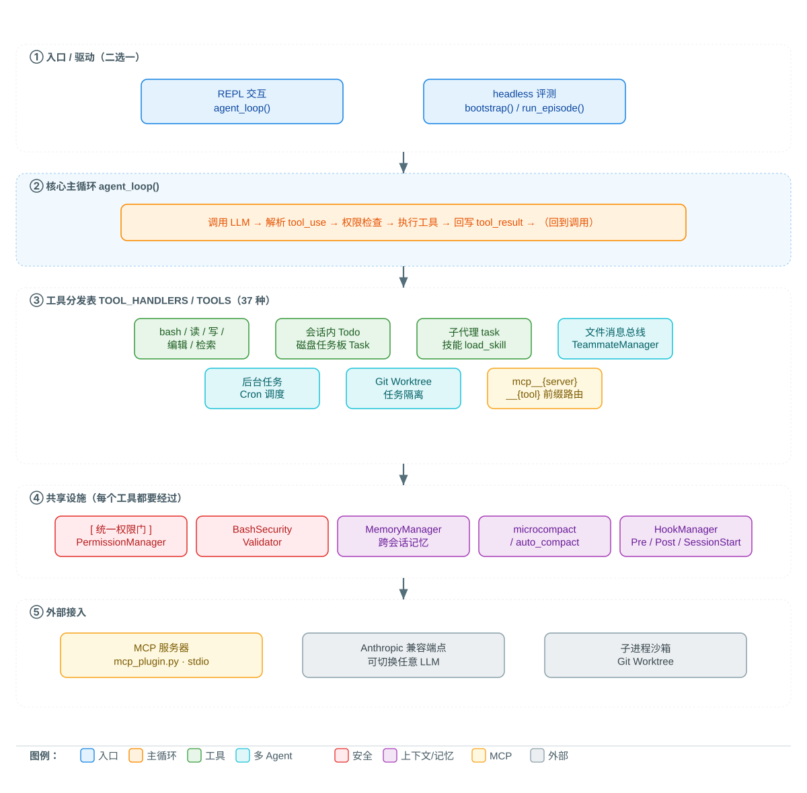

# Coding Agent Harness

基于 Python 从零实现的端到端 LLM 编程智能体（AI 编程助手）。它运行经典的 Agent 主循环——调用模型、执行工具、回写结果——并扩展到完整的多 Agent 协作平台：持久化任务板、定时调度、Git Worktree 任务隔离、MCP 外部工具接入。

模型负责推理，Harness 为模型提供一个安全、可控的工作环境。

## 核心能力

- **Agent 主循环**：`调用 LLM → 解析 tool_use → 执行工具 → 回写 tool_result`，循环直至模型给出最终回答
- **37 个工具**，由 JSON Schema 注册分发表驱动：bash、文件读/写/精确编辑、正则检索、子代理委派、会话内待办跟踪、持久化任务、后台任务、Cron 定时调度、团队消息
- **上下文管理**：每轮轻量压缩 + 超 10 万 token 触发 LLM 分块智能摘要；超大工具输出自动写入磁盘并替换为预览标记
- **多 Agent 团队**：文件邮箱消息传递、自主任务认领（互斥锁保护）、定向 / 广播消息、计划审批与关闭协议
- **安全体系**：路径沙箱、危险命令扫描、黑白名单 + 询问用户的权限管道（`plan` / `build` / `eval` 三种模式）
- **持久化**：跨会话记忆、带依赖关系的文件任务板、JSONL 消息总线、工作树事件日志
- **MCP 接入**：外部 MCP 服务器工具合并进统一工具池，复用同一权限门
- **Git Worktree 隔离**：按任务创建并行工作线，事件日志全程可审计
- **健壮容错**：指数退避重试（含随机抖动）、max_tokens 续写、输入超限自动压缩
- **headless 评测**：`bootstrap()` / `run_episode()` 将交互式 REPL 封装为可编程的一次性会话，`eval` 权限模式免审批，沙箱隔离 + JSONL 会话记录，配套 GAIA / SWE-bench 评测框架

## 架构

<div align="center">
  <a href="./docs/diagrams/architecture.svg" target="_blank" title="点击放大 / 新标签页查看">
    
  </a>
  <p><sub>上图为主架构图（<b>矢量图</b>，可点击放大、新标签页内自由缩放/平移）。五层自上而下：
  驱动 → 主循环 → 工具池 → 共享设施 → 外部接入；颜色即关注点（图例见图内底部）。</sub></p>
</div>

| 关注点 | 实现 |
|---|---|
| 主循环 | `agent_loop()` — 权限检查、Pre/Post 钩子、错误恢复、异步通知 |
| 工具 | `TOOL_HANDLERS` / `TOOLS` 注册分发表 + JSON Schema 定义 |
| 权限 | `PermissionManager` + `BashSecurityValidator` |
| 钩子 | `HookManager`（`PreToolUse` / `PostToolUse` / `SessionStart`） |
| 记忆 | `MemoryManager`（user / feedback / project / reference） |
| 任务 | `TaskManager`（持久化任务板）+ `TodoManager`（会话内清单） |
| 团队 | `MessageBus` + `TeammateManager`（生命周期、自主认领） |
| 调度 | `BackgroundManager` + `CronScheduler` |
| 隔离 | `WorktreeManager` + `EventBus` |
| MCP | `agents/mcp_plugin.py` — `MCPClient` / `PluginLoader` / `MCPToolRouter` |
| 评测 | `agents/eval_runner.py` — headless `run_episode` / 沙箱子进程 / 会话记录 |

## 关键设计取舍

每一项都围绕"动机 / 怎么做 / 代价 / 如何验证"，完整展开见 [`docs/DESIGN.md`](docs/DESIGN.md)。

- **统一权限门**：所有工具（含外部 MCP 工具）执行前都过同一个 `PermissionManager`——黑名单拒绝、规则表匹配、需确认则询问用户。避免各工具自写校验导致的漏检与绕过。
- **两级上下文压缩**：轻量 `microcompact`（旧工具结果替换为简短标记）+ 重量 `auto_compact`（LLM 分块智能摘要，失败回退原文）；配合超长工具输出落盘 + 预览标记。
- **子进程沙箱**：headless 评测默认在独立临时目录以子进程运行（`run_episode --workdir`），`.tasks/.memory/.team` 建在沙箱内，跑完即弃，评测不被上一次污染。
- **MCP 前缀路由**：外部工具映射为 `mcp__{server}__{tool}`，与原生工具共用分发表与权限门；插件清单自动发现并拉起服务器（stdio）。
- **会话回放**：每次 episode 的完整 messages 写 JSONL 到 `.transcripts/`，失败可重放、可做失败复盘。

## 快速开始

```sh
pip install -r requirements.txt
cp .env.example .env
```

编辑 `.env`：

```env
ANTHROPIC_API_KEY=sk-ant-xxx   # 必填，或使用兼容端点
MODEL_ID=claude-sonnet-4-6     # 必填，也可填兼容模型
# ANTHROPIC_BASE_URL=...       # 可选：代理 / 内网 / 第三方兼容服务
```

运行：

```sh
python agents/Agent_Harness.py
```

出现 `agent >>` 提示符后直接输入任务，例如：

```
agent >> 搜索仓库里所有 TODO 注释，汇总到 todo_list.md
```

### 权限模式

运行期可用 `/mode <mode>` 切换：

- `plan` — 只读模式
- `build` — 正常读写，危险操作（bash、写入等）需用户确认（默认）
- `eval` — 评测模式，免审批直接放行（headless 评测自动启用）

## 目录结构

```
agents/
  Agent_Harness.py      # 完整 Harness：主循环、工具、权限、钩子、
                        # 记忆、任务、团队、Cron、后台任务、Worktree
  eval_runner.py        # headless 评测入口：run_episode / 沙箱子进程 / JSONL 会话记录
  mcp_plugin.py         # MCP 客户端 / 插件发现 / 工具路由
  error_classifier.py   # 通用错误分类器：FailureEvidence → 6 维度（rule/llm/fallback 三层）
  README.md             # 能力与工具详细说明
benchmarks/
  gaia_eval.py          # GAIA 评测（精确匹配 + LLM-as-judge 双评分）
  swebench_eval.py      # SWE-bench 评测（clone@base_commit → patch → test 校验，支持 --augment 对比）
  run_swebench_official.py  # 官方 harness 本地化包装（预构建镜像跑 FAIL_TO_PASS/PASS_TO_PASS）
  stress_compact.py     # 长会话压缩压测（auto_compact 前后 token 对比）
  synth_negatives.py    # 数据合成 ①：从失败案例构造"错误对比对"（bad patch ⇄ 修正 patch）
  synth_rubric.py       # 数据合成 ②：生成 rubric + LLM-as-judge 判分 + 质控统计
  classify_failures.py  # 失败归因：走 ErrorClassifier 回填跨 benchmark 错误类型（6 维度）
  results_sink.py       # 结果沉淀（JSONL + BENCHMARK_{name}.md 汇总）
  visualize.py          # 结果可视化（dashboard / per_repo / per_instance 图表）
  results/              # 评测结果留档（JSONL + BENCHMARK_{name}.md + 合成数据 + 可视化图表）
docs/
  DESIGN.md             # 设计文档：系统架构 + 关键设计取舍
  BENCHMARK.md          # 评测报告：SWE-bench 官方判定 + 失败复盘 + GAIA 口径
  DATA_PIPELINE.md      # 数据流水线：合成数据规范 + 质检规则 + 迭代验证方法
  ERROR_TAXONOMY.md     # 通用跨 benchmark 错误分类法 + 映射规则（错误归因）
  eval-stress-roadmap.md# 评测与压测接入路线图
scripts/
  reproduce_benchmark.sh# 一键复现 SWE-bench（patch 生成 → 官方判定 → 沉淀）
examples/mcp/
  echo_server.py        # 极简 stdio MCP 服务器（echo/add/upper）
  db_server.py          # 基于 SQLite 的 MCP 服务器（只读 SQL、建表语句、笔记写入）
  .claude-plugin/       # 插件清单，接入上述 MCP 服务器
tests/
  test_agents_smoke.py            # 全部 agent 模块的编译冒烟测试
  test_mcp_integration.py         # MCP 客户端 / 路由器 / 插件的端到端测试
  test_eval_runner.py             # headless 评测（Mock 客户端）单元测试
```

## 测试与工程配置

```sh
pip install -r requirements.txt -r requirements-dev.txt   # 运行依赖 + 开发依赖

python -m pytest tests/ -q   # 全部单测（含 TodoManager/MCP/headless 评测 Mock 测试）
ruff check .                  # lint（pyproject.toml 配置了行宽/规则/排除项）
mypy agents/                  # 类型检查（渐进式：未标注处不强求）
```

其中：
- **`ruff`（linter）**：静态扫描代码里的真实错误与坏习惯（未使用导入/变量、未定义名字、潜在 bug）。`pyproject.toml` 只启用核心规则 `E/F/W` 并关掉中文注释噪音（`RUF002/RUF003`）与行宽 `E501`，收敛到"发现真实隐患"。
- **`mypy`（类型检查）**：不运行代码，只对照类型标注找"这里可能是 `None`""参数类型传错"这类隐患。开启 `implicit_optional`、`ignore_missing_imports`，并以 `check_untyped_defs = false` 做**渐进式**检查——只严查已标注处，未标注处不强求（对约 3300 行单文件是务实取舍）。
- **`pytest`（单元测试）**：真正执行代码并断言行为正确。`tests/` 覆盖模块编译冒烟、TodoManager、MCP 端到端、headless 评测 Mock 等 36 个用例，全程使用 Mock 客户端、不依赖真实 API。

三者的行为配置统一写在 [`pyproject.toml`](pyproject.toml) 的 `[tool.ruff]` / `[tool.mypy]` / `[tool.pytest.ini_options]` 分节里——一个文件集中管理，代码与配置同源可复现。

均为 CI 的一部分（见 `.github/workflows/test.yml`）：push / PR 到 `main` 时 GitHub 自动在云端跑「装依赖 → `ruff check .` → `mypy agents/` → `pytest tests/ -q`」三关，任一失败即拦截。因此"测试通过""类型无误"由自动化机制保证，而非人工声明——这与项目"用可核验结果而非漂亮数字支撑结论"的主线一致。

## 示例

仓库内置两个可直接接入 Harness 的 MCP 示例服务器：

- `echo_server.py` — 极简 stdio MCP 服务器，实现 `initialize` / `tools/list` / `tools/call`
- `db_server.py` — 基于 SQLite 的 MCP 服务器，暴露 `list_tables`、`get_schema`、`query_db`（强制只读 `SELECT`）、`insert_note`；首次运行自动创建示例数据库

接入方式：把 `examples/mcp/.claude-plugin/plugin.json` 复制到工作目录，启动 Harness 后即可通过 `mcp__echo__*`、`mcp__db__*` 工具调用外部能力；REPL 中可用 `/mcp` 查看已连接的服务器及工具。

## 评测

把"人工驱动的交互式 REPL"重构为"可编程的一次性会话"，可在 headless 环境下批量跑 benchmark。路线图见 `docs/eval-stress-roadmap.md`，完整评测数据与失败复盘见 **[`docs/BENCHMARK.md`](docs/BENCHMARK.md)**。

### headless 评测入口（阶段 1）

```sh
# 单个任务（当前进程内运行）
python agents/eval_runner.py "列出当前目录"

# 沙箱隔离：在独立 temp 目录内以子进程运行，不污染主仓库
python agents/eval_runner.py "修复 build 报错" --workdir /tmp/eval_001

# 指定会话记录路径 + 限制工具轮数
python agents/eval_runner.py "完成任务" --transcript /tmp/ep.jsonl --max-rounds 20
```

成功后向 stdout 打印 JSON：`{"final_reply": "...", "transcript": "...", "rounds": N, "elapsed_s": ...}`。

核心 API（供脚本复用）：

- `bootstrap()` — 统一初始化（记忆 / Cron / SessionStart 钩子 / MCP），REPL 与评测同源
- `run_episode(prompt, transcript_path, eval_mode, max_rounds)` — 重置全局状态 → 执行主循环 → 返回 `(history, final_reply)`
- `eval` 权限模式 — `PermissionManager` 免审批放行，headless 运行不阻塞等待用户输入
- `reset_runtime_state()` — 每次 episode 前重置全局单例，防止跨任务状态污染
- JSONL 会话记录 — 每次 episode 完整对话写入 `.transcripts/`，失败可回放调试

### 压测（阶段 4）

合成长历史触发 `auto_compact`，实测压缩前后 token 与耗时：

```sh
python benchmarks/stress_compact.py --target-chars 500000
```

**实测结果**（deepseek-chat，2026-08-21）：

| 指标 | 值 |
|---|---|
| 输入 | 50.9 万字符 / 12.7 万 token（64 条消息） |
| 压缩后 | 2842 字符 / 710 token（1 条续接消息） |
| **token 减少** | **99.4%** |
| 耗时 | 27.2s（7 分块摘要 + 1 合并，共 8 次 LLM 调用） |

### GAIA（阶段 3）

```sh
python benchmarks/gaia_eval.py --max 5 --split test        # 前 5 条 level1 纯文本
python benchmarks/gaia_eval.py --max 5 --judge             # 启用 LLM-as-judge 二次评分
```

**实测结果**（deepseek-chat，2026-08-26，`2023_level1` 纯文本子集，5 条中 4 条完成）：

| 指标 | 值 |
|---|---|
| 精确匹配（exact） | 0 / 4 |
| LLM-as-judge 通过 | **3 / 4（75%）** |
| 平均轮次 | 1.25 |
| 平均耗时(s) | 21.65 |

> 口径：exact=0 说明模型未给出与答案逐字一致的回答（GAIA 标准极严）；judge 侧为同模型 LLM-as-judge，
> 存在"自说自话"偏差、结果更乐观，二者分开标注。第 5 条问题引导 Agent 探测本机网络/代理配置，陷入无界探测被超时中断（未收敛）。

### SWE-bench（阶段 2）

```sh
python benchmarks/swebench_eval.py --max 3 --lite                        # 只出 patch
python benchmarks/swebench_eval.py --max 3 --lite --run-tests            # gold test patch 校验
python benchmarks/swebench_eval.py --ids django__django-10087,pallets__flask-4045  # 指定实例白名单

# 官方真实测试判定（Docker 预构建镜像 + swebench harness）
# 先预拉镜像并打 tag（镜像代理：docker.1ms.run，Docker Hub 直连不通的机器用）
# 再运行（本地化包装：monkeypatch 从本地 worktree 读 requirements，避免 GitHub raw 网络依赖）
python benchmarks/run_swebench_official.py -d benchmarks/results/swebench_local.json \
    -p benchmarks/results/predictions_swebench.json -i <ids...> \
    --max_workers 2 -t 1800 -n swebench --cache_level instance \
    -id <run_id> --report_dir benchmarks/results/swebench_reports
```

> 评测规范：严禁将 gold patch / test patch 注入模型输入；评测脚本与数据下载记录将随结果归档留证。

**实测结果**（deepseek-chat，2026-08-22，6 个实例跨 6 仓库；官方判定用 swebench 4.0.5 + 预构建 Docker 镜像跑 FAIL_TO_PASS/PASS_TO_PASS）：

| instance | 官方判定 | rounds | elapsed_s | FAIL_TO_PASS / PASS_TO_PASS |
|---|---|---|---|---|
| psf__requests-1142 | **RESOLVED** | 28 | 49 | 1/1 通过；5/5 通过 |
| django__django-10087 | FAIL | 60 | 141 | patch 应用失败（模型补丁缺末尾换行） |
| pallets__flask-4045 | FAIL | 63 | 253 | F2P 0/2 通过；P2P 50/50 通过 |
| pytest-dev__pytest-10051 | FAIL | 26 | 48 | F2P 0/1 通过；P2P 14/15（1 回归） |
| sphinx-doc__sphinx-10021 | - | 32 | 57 | 未产出有效 diff，未提交 |
| sympy__sympy-11232 | - | 未记录 | 795.5 | 子进程超时，未产出有效 diff |

**官方用例通过 1/4（提交评测的 4 条中 requests 真正 resolve）**，平均耗时 223.9s（6 条）。为避免把 sympy 缺失的轮数当作 0 造成"平均轮次"失准，不列轮数平均值，以逐实例轮数表格为准。完整记录与图表见 `benchmarks/results/`。

> 口径说明：官方判定才是真实测试通过（官方 Docker 镜像跑 FAIL_TO_PASS/PASS_TO_PASS）。评测全程严禁 gold patch / test patch 注入模型输入。

### 结果可视化

把 `benchmarks/results/{name}.jsonl` 渲染为图表（dashboard / 按仓库汇总 / 逐实例明细）：

```sh
python benchmarks/visualize.py --name swebench     # 默认渲染 swebench，可换 gaia 等
python benchmarks/visualize.py --no-show           # 只存图到 results/visualization/，不弹窗
```

输出三张 PNG：`dashboard.png`、`per_repo.png`、`per_instance.png`，同时打印汇总指标与逐实例文本表格。

### 结果沉淀（阶段 5）

所有结果统一写入 `benchmarks/results/{name}.jsonl`，汇总生成 `BENCHMARK_{name}.md`（每个数据集独立文件，互不覆盖）：

```sh
python benchmarks/results_sink.py --name swebench --model deepseek-chat --config "6 instances, official harness"
python benchmarks/results_sink.py --name gaia     --model deepseek-chat --config "max=5, judge=off"
```

## 数据合成与迭代（Phase 6）

把 **SWE-bench 官方判定的失败案例**变成**可复用数据**，补齐"训练 / 数据"这一条腿：

```sh
# ① 从失败案例构造"错误对比对"（仅用 agent 失败 patch，gold patch 零注入）
python benchmarks/synth_negatives.py --max 4 --name synth_negatives
# ② 生成 rubric + LLM-as-judge 判分 + 质控统计
python benchmarks/synth_rubric.py --name synth_negatives --out synth_rubric
# （可选）失败归因：走通用 6 维度分类器（跨 benchmark），只处理失败实例
python benchmarks/classify_failures.py --name swebench --only-failed
# （可选）前后对比：基线 vs 注入合成负例
python benchmarks/swebench_eval.py --ids django__django-10087,pallets__flask-4045 \
    --augment benchmarks/results/synth_negatives.jsonl --name augmented_subset
```

数据规范、质检规则、迭代验证方法与诚实边界见
[`docs/DATA_PIPELINE.md`](docs/DATA_PIPELINE.md)；失败的错误归因分类法（跨 benchmark 通用）见
[`docs/ERROR_TAXONOMY.md`](docs/ERROR_TAXONOMY.md)。

> 诚信底线：正例是 **LLM 合成的"修正 patch"，不是 gold patch**；`gold_patch_used` 恒为 `False`。
> "前后对比"是否算提升，必须以**配对 + 方差 + 官方测试**判定，未跑通则**不虚称**。

## 测试与 CI

测试、lint、类型检查已在上文「测试与工程配置」说明；CI 见 `.github/workflows/test.yml`（push 触发，三件套全跑）。

## License

MIT
