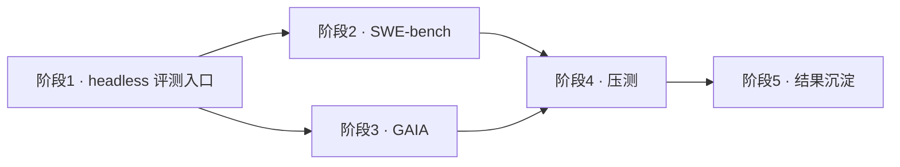

# 评测与压测接入路线图（Coding Agent Harness）

## 总体顺序

阶段 1 是硬前提；2/3 可互换（均可先跑，先跑更简单的能更快验证 pipeline），二者都汇入压测；4 不烧 API 钱，随时可并行。

---

## 阶段 1 · headless 评测入口（一切的前提）

目标：把"manual REPL"变成"可编程的一次性会话"。

1. **抽 `bootstrap()`**：将 `__main__`（`agents/Agent_Harness.py`）里的记忆加载、CRON.start、MCP 连接、SessionStart hook 抽出为复用函数；新增 `run_episode(prompt) -> (history, final_reply)`。
2. **全局状态隔离**：MEMORY / BUS / TASK_MGR / BG / CRON 都是进程级单例，每个 episode 前必须重置，否则前后任务互相污染。
3. **评测免审批**：给 `PermissionManager` 加 `eval` 模式，让 `ask_user` 直接返回 True——否则会在 `input()` 卡死。
4. **沙箱隔离**：每实例独立 temp 目录/worktree，不污染主仓库；复用 `maybe_persist_output` 落盘超长产物。
5. **会话留痕**：messages 写 JSONL，失败可回放调试。

**验收**：`run_episode("列出当前目录")` 能在无 stdin 下跑完并返回文本。

---

## 阶段 2 · SWE-bench

- **数据**：`princeton-nlp/SWE-bench` 或 `swebench` pip 包，取 **SWE-bench-lite 子集，先跑 30 条**。
- **流程**：clone 仓库@base_commit → 把 issue 文本喂 `run_episode` → 结束取 `git diff` 为模型 patch → 用官方 gold test patch 做 PASS_TO_PASS / FAIL_TO_PASS 校验。
- **指标**：resolve rate、单条成本、平均轮次与 token。
- **成本控制**：`.env` 的 `ANTHROPIC_BASE_URL` 指向 DeepSeek（Anthropic 兼容协议）跑首批，确认 pipeline 无误再扩量。

---

## 阶段 3 · GAIA

- 取 level1 纯文本子集（无需 web 工具），喂问题 → 取最后一条 assistant 文本 → ground truth 精确匹配 + LLM-as-judge 双评分。
- 比 SWE-bench 简单，适合作为 pipeline 的快速验证。

---

## 阶段 4 · 压测

- `stress_compact.py`：合成长历史触发 `auto_compact`，实测压缩前后 token 与耗时 → **补长会话输入 token 减少约 ×% 的实测数据**。
- `stress_team.py`：K 队友并发抢同一任务，断言唯一 winner，记录 p50/p95。
- `stress_bus.py`：N 写 × M 读下断言消息零丢失零损坏，测吞吐。
- 工具：`concurrent.futures` + `pytest-benchmark`，profile 用 cProfile / memray。

---

## 阶段 5 · 沉淀

- `benchmarks/results/` 汇总表格 + 一份 BENCHMARK.md，记录配置、模型、成本、通过率。
- 真实数字沉淀：SWE-bench resolve rate、压缩省 token 实测、并发吞吐。

---

## 提醒

- **时间线建议**：SWE-bench 全流程（含首批 30 条）建议 2 周内完成，压测 1 周，之后数字即可沉淀为可复现结果。
- **诚信底线**：SWE-bench 严禁用 gold patch 污染 prompt，评测脚本与数据下载记录要留档，保证全程可核验。
